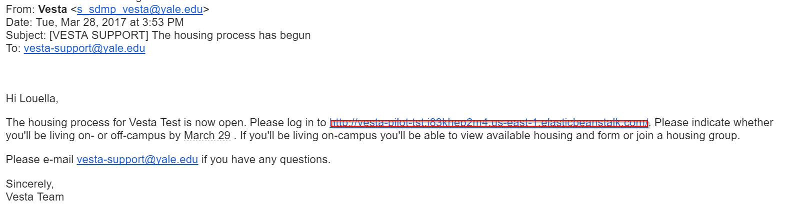
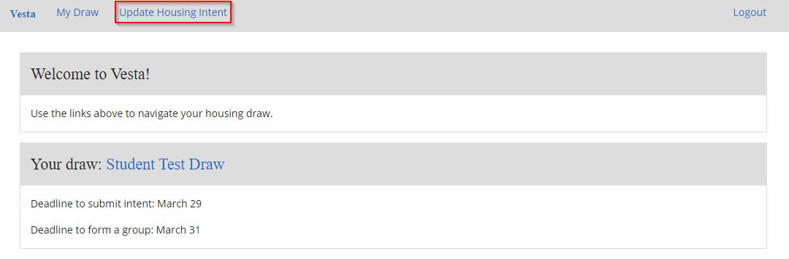
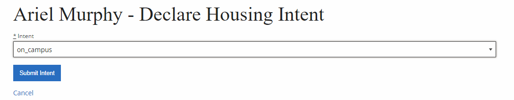
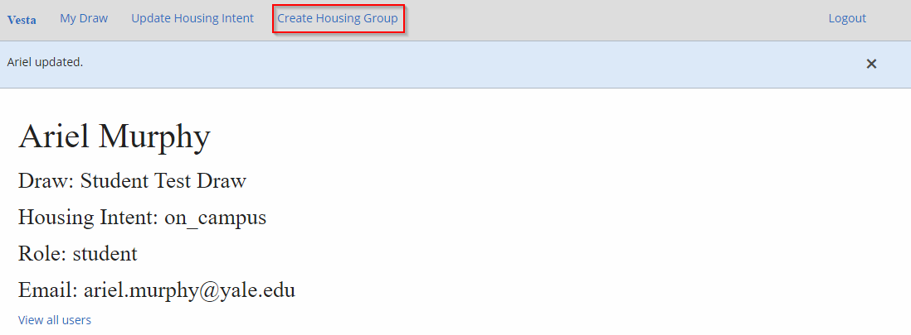
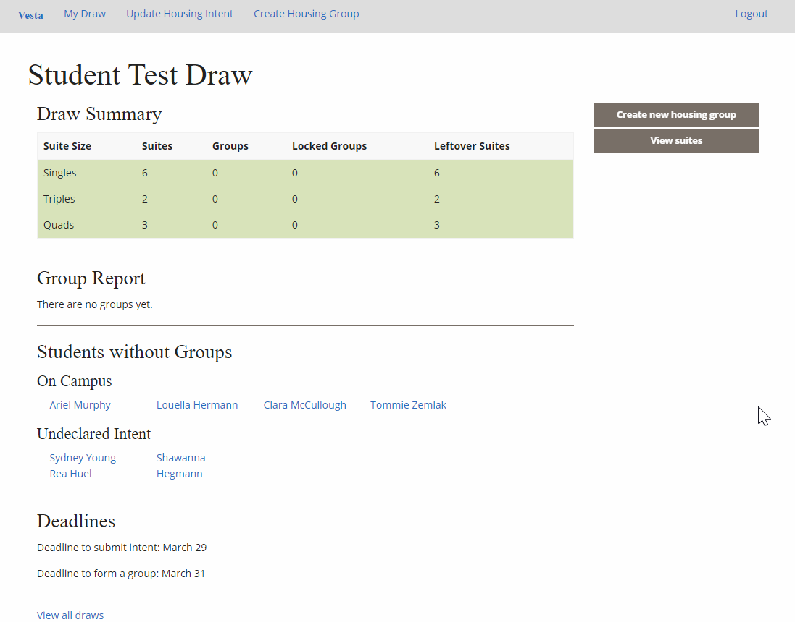
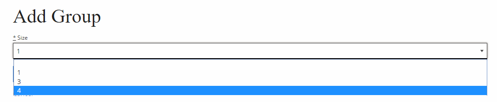
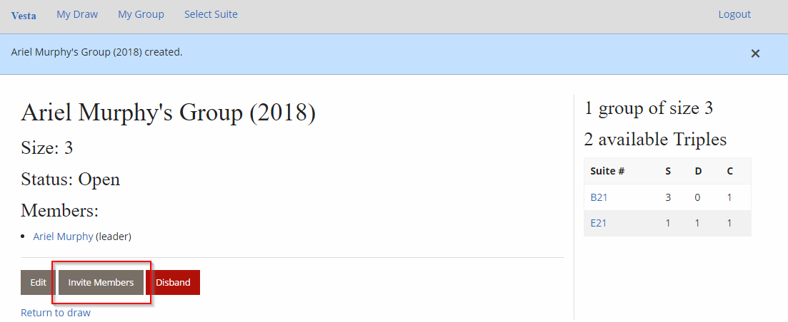
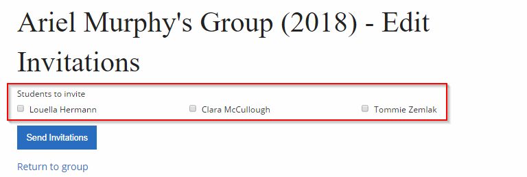
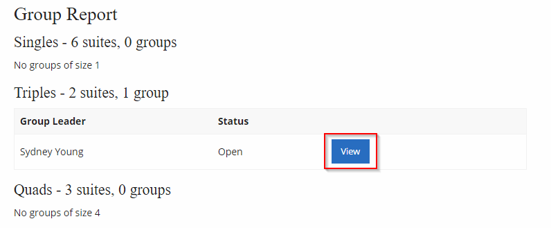
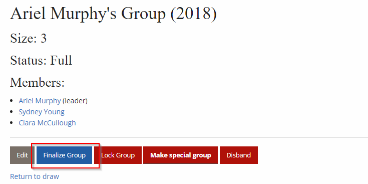

# Student Guide
 Dean, or housing committee member? [Admin Guide](admin) 

The guide for students using Vesta to select their rooms. This tutorial assumes that an administrator has started your housing process for this year using Vesta. If your Dean has not, speak to them.

[Glossary for Terms and Notation](terms)

## **Starting the Housing Draw**

You have just received an email inviting you begin your college’s housing process! Click on the link boxed in red to begin.

## On-Campus or Off-Campus?

The first thing you should do is to indicate your intent to live on- or off-campus. Select *Update Housing Intent* from the toolbar at the top of the page.

Use the dropdown menu under your name to select on- or off-campus, then click *Submit Intent*.

You are free to change your intent until your Dean begins the lottery process. At that point, you will be locked into the selection you’ve made.

If you are living off-campus, this is the end of of your housing process. There are no further steps you must take.

If you are living on-campus, read on.

## Creating a Group

Every person who is living on-campus must create a group. Even if your group is just you (seeking to live in a stand-alone single) you must be in a group. Once you know who should be in your group, choose a Group Leader. This person will be responsible for many of the next steps.

As soon as you update your Housing Intent to select living on-campus, a *Create Housing Group*** **button will appear on your toolbar.

At any time, you can see who is in your Housing Draw by clicking *My Draw* from the toolbar at the top of the page. This lets you see who is in a group, who is not, and who has not submitted their housing intent yet.

## Group Leaders

The only available size options for groups will be the size of the rooms available in the Housing Draw you are in. Every college has many different setups with different available group sizes. If you think there has been an error in available rooms, speak with your Dean.

Once you have created your group, select *Invite Members. *

You will be able to invite any student who has indicated an interest in living on-campus next year.

## Group Members

Once your group has chosen a Group Leader and they have sent invitations to people to join, select *View* next to that group.

Then select, *Accept Invitation. *

You have the option of leaving the group until your group is locked. Once it is locked, only an admin can unlock it.

## Moving to the Lottery as a Group Leader

Your first step will be to select Finalize Group. This will let the members of your group cement themselves in.

