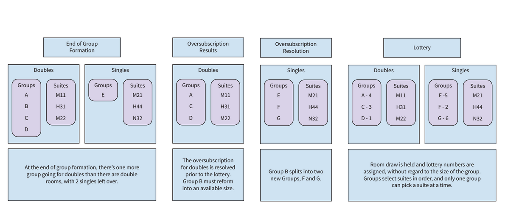

# **Oversubscription Models**

Offline, talk to the leaders of the groups of oversubscribed size. Choose the groups that will disband and reform into different sized groups. (This is often referred to as "pre-draw")

A draw cannot proceed from pre-lottery into lottery until all students are in groups. Groups without available suite sizes will not allow progression from pre-lottery to lottery until groups of that size disband and reform groups of available sizes.

[<< back](admin)