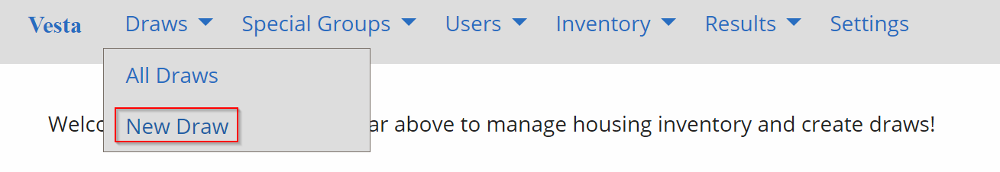
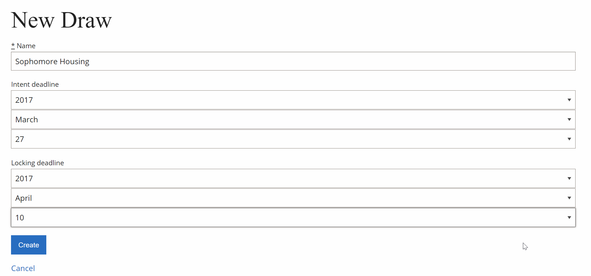
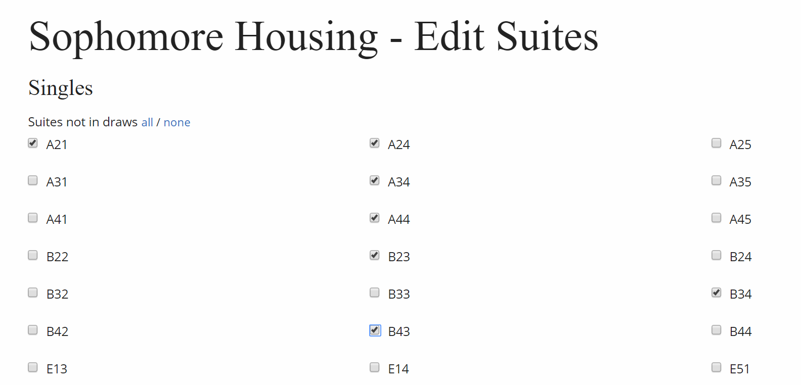
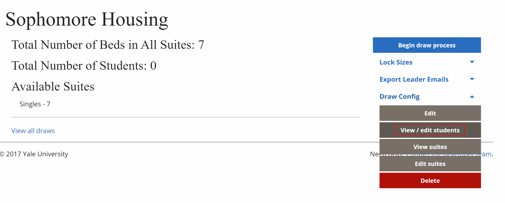
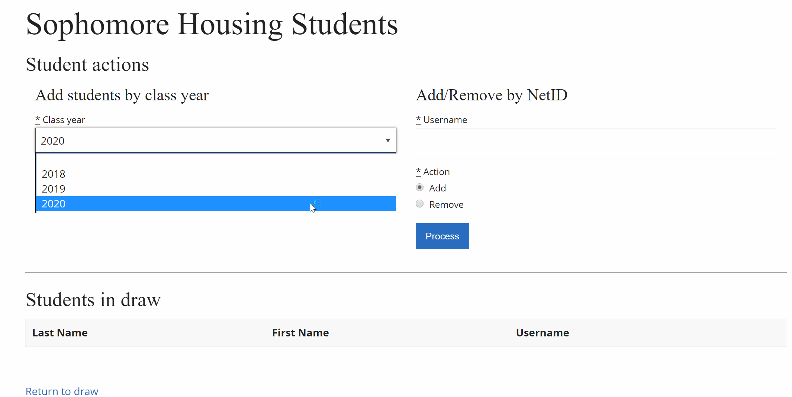
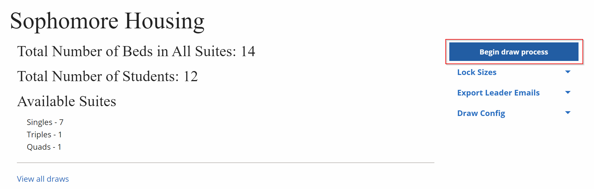

# Running a Draw

## 1. Create a new Draw

From the home page, navigate to Draws > New Draw.

Fill out the "Name" field with a simple descriptive name, like “Sophomore Housing.” The intent deadline date is the date by which students must indicate whether they are staying on or off campus. The locking deadline is the date by which students must have formed locked groups.

## 2. Add Suites to Draw

From Draw > All Draws, click on the Draw of interest.

Under *Draw Config,* select *Edit Suites. *Select the suites that should be in this Draw.

If there are parenthesis next to a suite, that indicates that the suite is involved in another draw. These suites can still be added to this draw. When complete, click *Update* at the bottom of the page.

## 3. Add Students to Draw

From Draw > All Draws, click on the Draw of interest. Under *Draw Config,* select *View/Edit Students.*

Add students by class year relevant to the current Draw.

If there are any students who should be added or removed, enter their NetID and click *Process.*

## 4. Activate the Draw

From Draws > All Draws, click on the relevant Draw.

Ensure that there are enough beds for the number of students, and that there is at least one student in the Draw.

[<< back](admin)