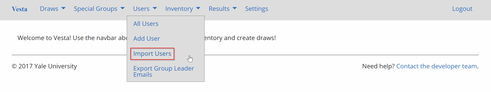
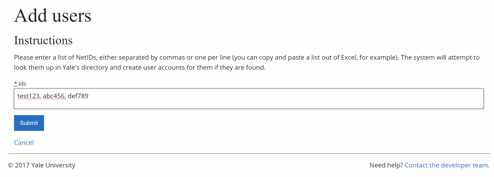
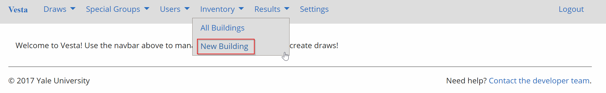
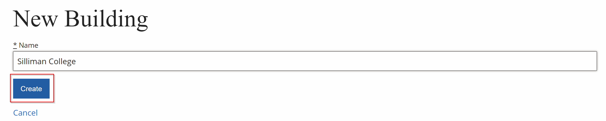
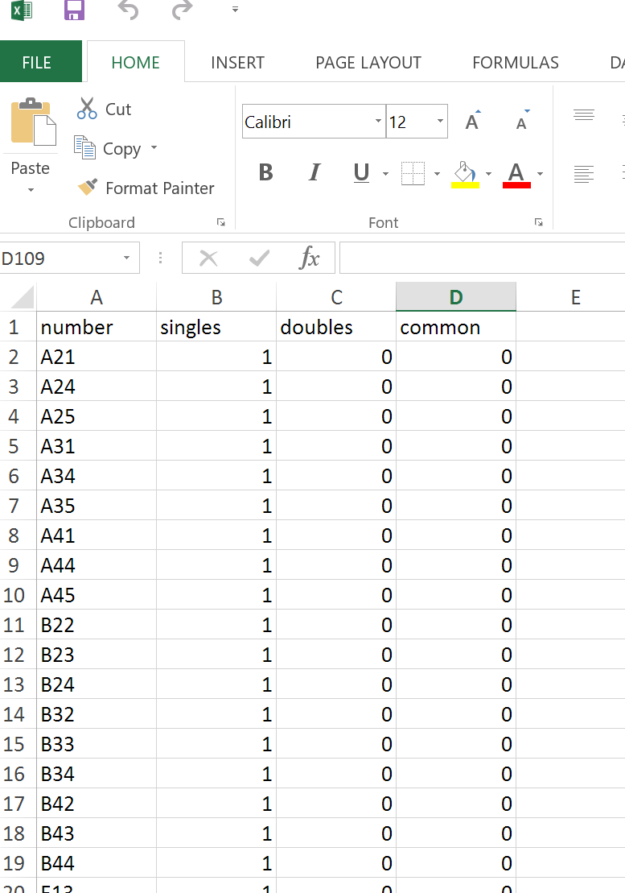

# Setup

This section will only have to be done once, unless there are any changes to the rooms themselves.

## 1. Import Students

From the home page, navigate to Users > Import Users.

Paste a comma or newline separated list of NetIDs of the students, then click *Submit*.

## 2. Create Buildings

From the homepage, navigate to Inventory > New Building.

Fill in the form and press create.

Note that building is NOT in reference to entryway, but a college. Refer to the terminology for further elaboration.

## 3. Create Suites

From the homepage, navigate to Inventory > All Buildings.

Then click on *View *under the building you want to set up. Create a .CSV file for the suites in your building, then upload it, then click *Import.*

Please note that entryways are implicit in the room number, i.e. a room number should be formatted I33, L01, etc.

[<< back](admin)